# MesStocks

Application mobile de gestion de stocks pour une équipe d'électriciens. Cette application, fonctionnelle avec Android et iOS, permet de gérer son stock d'articles, de les personnaliser en y ajoutant des catégories, des sous-catégories, des marques et le nom des utilisateurs, et permet également de visualiser l'historique des flux (entrées/sorties) de chaque article et des modifications apportées sur l'application.

Cette application est commune à tous les utilisateurs, elle n'est pas encore adaptée pour la gestion de plusieurs comptes utilisateurs.

**Découverte de React Native.** 
Ayant déjà utilisé React, j'ai pu vite m'y retrouver étant donné que ces bibliothèques sont très proches. J'utilise JavaScript pour réaliser le design de l'application mais aussi pour les liaisons avec la base de données Firestore.

## Disponible sur

| Android | iOS |
| ------ | ------ |
|  |  |

## Les interfaces

### Les interfaces de navigation

**Récap'** permet de voir une récapitulation générale des stocks. On voit le nombre d'articles, les sous-catégories avec leur nombre de produit à commander, le cas échéant, et les 5 dernières entrées/sorties.

Depuis cette page, on peut accéder à la page Rechercher (clic sur une sous-catégories -> affichage des articles de celle-ci, clic sur À Commander -> affichage des articles en manque de stocks), à la page Ajouter (clic sur Ajouter une donnée), à la page Historique (clic sur les 3 petits points en bas du premier visuel de l'historique des entrées/sorties), à la page des Derniers évènements (clic sur le logo Temps en haut à droite) et à la page Fiche article (clic sur le déplacement d'un article depuis le premier visuel de l'historique).

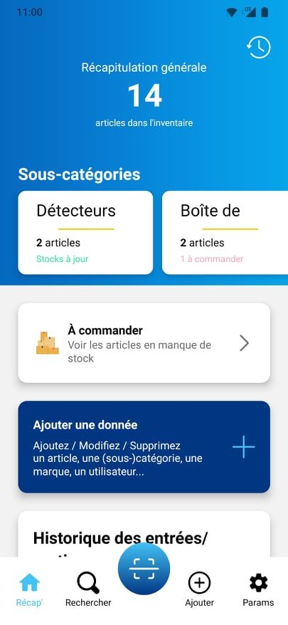
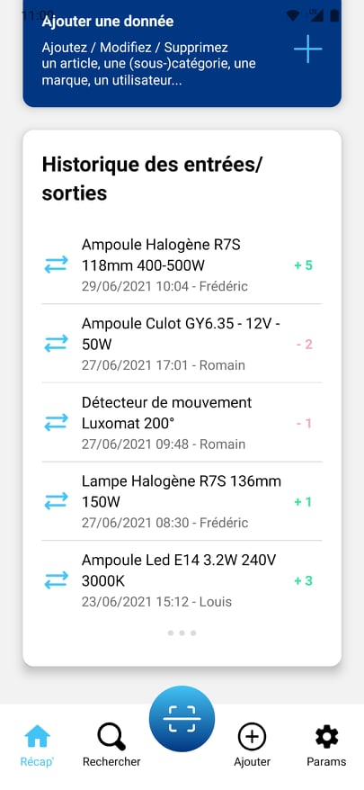

**Rechercher** permet de rechercher un article. Une barre de recherche et plusieurs filtres facilitent cette recherche. On peut filtrer les articles par leur catégorie, leur sous-catégorie, leur marque et le type (A commander / Stocks à jour).

Depuis cette page, on peut accéder à la fiche article (clic sur l'article en question), et revenir sur la page principale (clic sur Retour -> page Récap').

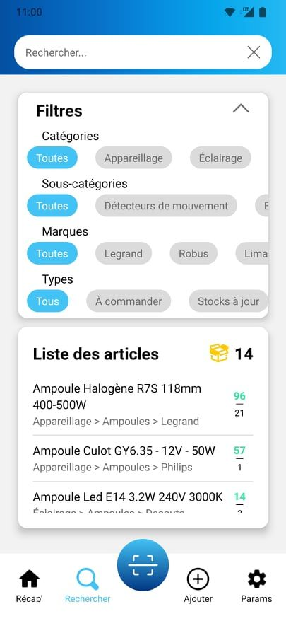

**SCAN** permet de réaliser une entrée ou une sortie de stock en scannant un QR Code unique à chaque article. On doit préciser le type (Entrée / Sortie) et le nombre d'articles déplacés. On peut éventuellement préciser l'utilisateur à l'origine de ce mouvement. Lors du scan, l'application reconnaît l'article, et affiche son nom ainsi que son stock et son stock mini. 

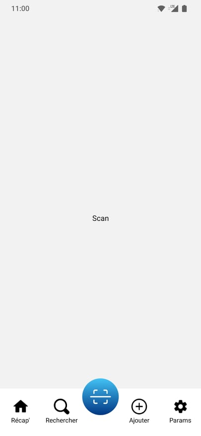

**Ajouter** permet d'ajouter, modifier, supprimer une donnée (catégories, sous-catégories, marques, utilisateurs) et d'accéder à une nouvelle fiche article pour ajouter un article. On voit le nombre de chacun des données en haut de la page, et le nom de celles-ci dans leur espace dédié.

Une modal s'ouvre lors de l'ajout et la modification d'une donnée pour saisir le nouveau nom.

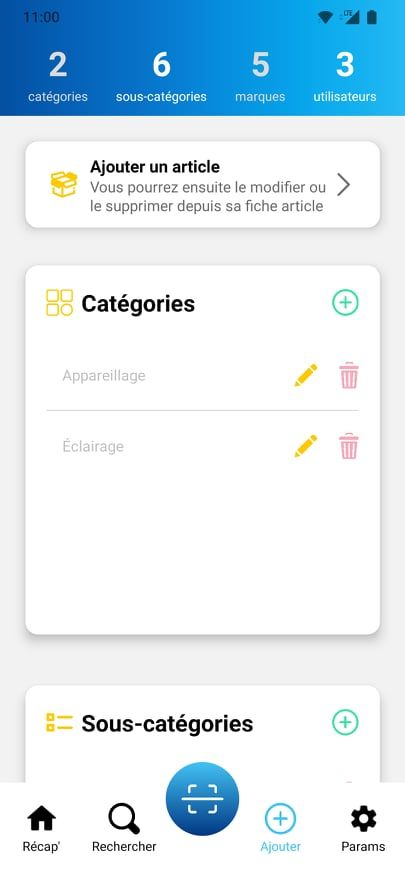
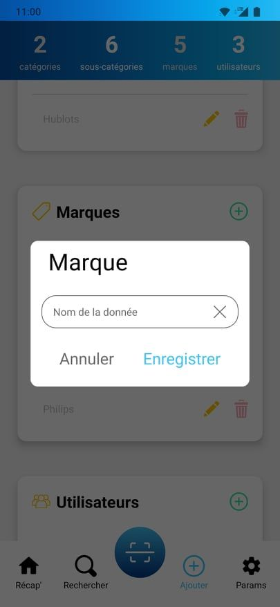

**Params** permet de gérer les paramètres de l'application : le thème (clair/sombre) et les notifications (entrées/sorties, article en manque de stock, lors d'une création, modification, suppression d'une donnée). Mais aussi pour exporter les données en format pdf/xlsx (envoyé par mail).

Ces préférences (thèmes et notifications) sont communes à tous les utilisateurs, étant donné que l'application ne les différencie pas encore.

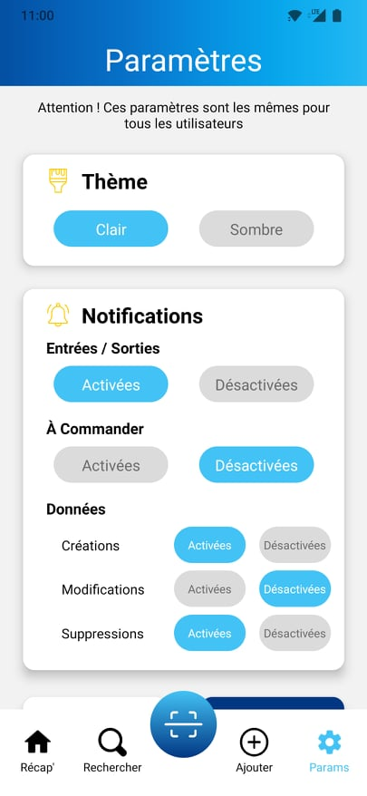
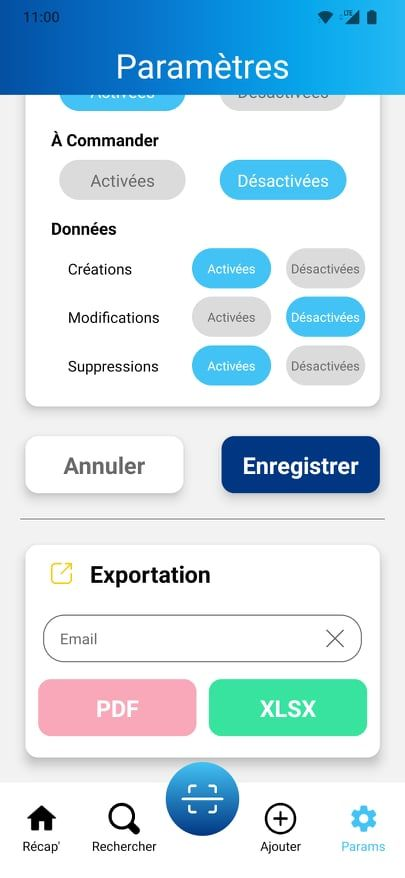

### Les autres interfaces

**Derniers évènements** permet de voir l'historique des création/modifications/suppressions de toutes les données. Elle est accessible depuis la page Récap'.

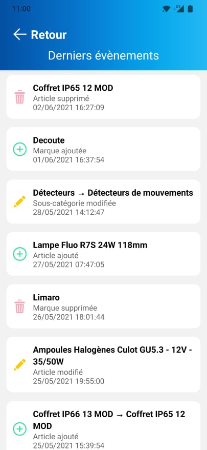

**Historique** permet de voir l'historique de toutes les entrées/sorties de stocks. Elle est accessible depuis la page Récap' et depuis la page Fiche article pour voir l'historique de l'unique article. Un système de filtres est aussi mis en place pour faciliter la visualisation (Type : Tous/Entrées/Sorties, Personne : utilisateurs, Période : Toutes/Mois/Semaine/Aujourd'hui). On peut également voir le nombre d'entrées et sorties en haut de la page suivant la recherche.

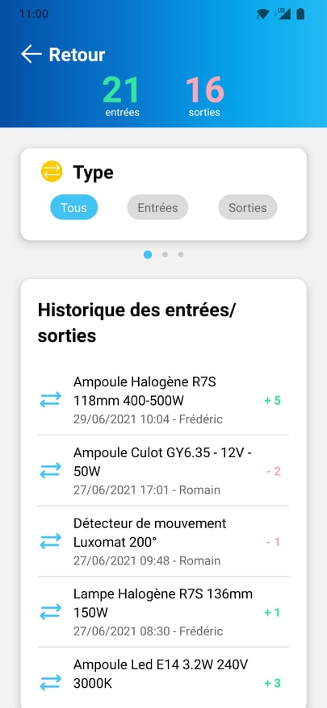

**Fiche article** permet de créer, modifier et supprimer un article. Elle est accessible depuis la page Récap' et Rechercher pour créer/modifier/supprimer un article, et depuis la page Ajouter pour créer un nouvel article.

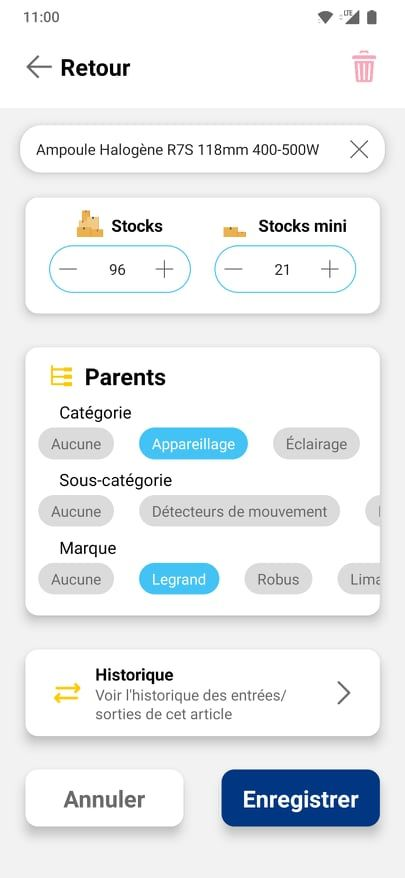
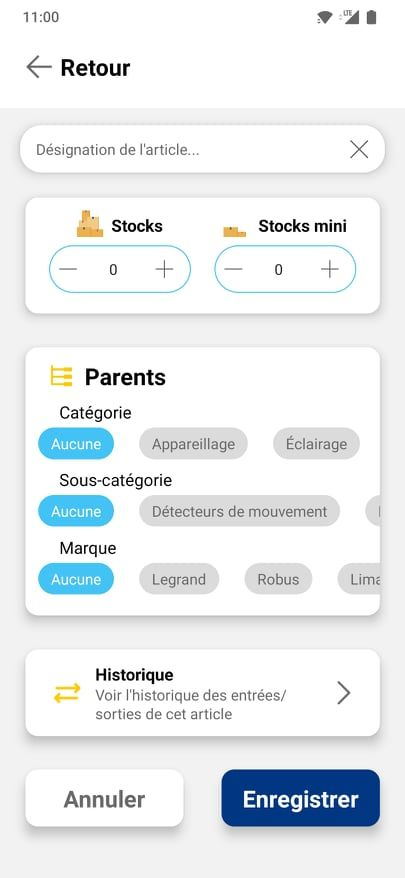

## Liens utiles

Pour commencer mes premiers designs, je suis parti sur ce tutoriel très bien fait de ByProgrammers : https://www.youtube.com/watch?v=xBmx2eaozck&t=59s.

La base de données cloud NoSQL, flexible et évolutive, me permet de stocker et synchroniser les données pour le développement côté client et côté serveur en temps réel : https://firebase.google.com/docs/firestore 

Voici un petit lien pratique pour les toast façon Android pour Android/iOS : https://github.com/crazycodeboy/react-native-easy-toast

