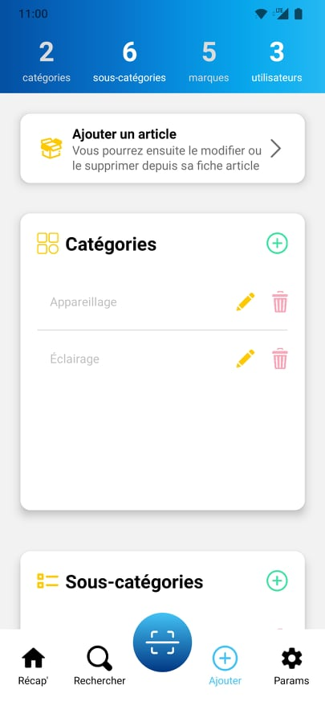

# MesStocks

Application mobile de gestion de stocks pour une équipe d'électriciens. Cette application, fonctionnelle avec Android et iOS, permet de gérer son stock d'articles, de les personnaliser en y ajoutant des catégories, des ous-catégories et des marques, et permet également de visualiser l'historique des flux (entrées/sorties) de chaque article et des modifications apportées sur l'application.

**Découverte de React Native.** 
Ayant déjà utilisé React, j'ai pu vite m'y retrouver étant donné que ces bibliothèques sont très proches. J'utilise JavaScript pour réaliser le design de l'application mais aussi pour les liaisons avec la base de données Firestore.

## Disponible sur

| Android | iOS |
| ------ | ------ |
|  |  |

## Les interfaces

| Récap' | Rechercher | SCAN | Ajouter | Params | Derniers évènements | Historique | Fiche article |
| ------ | ------ | ------ | ------ | ------ | ------ | ------ | ------ |
|  |  | |  |  |  |  |  |

## Liens utiles

Pour commencer mes premiers designs, je suis parti sur ce tutoriel très bien fait de ByProgrammers : https://www.youtube.com/watch?v=xBmx2eaozck&t=59s.

La base de données cloud NoSQL, flexible et évolutive, me permet de stocker et synchroniser les données pour le développement côté client et côté serveur en temps réel : https://firebase.google.com/docs/firestore 

Voici un petit lien pratique pour les toast façon Android pour Android/iOS : https://github.com/crazycodeboy/react-native-easy-toast

